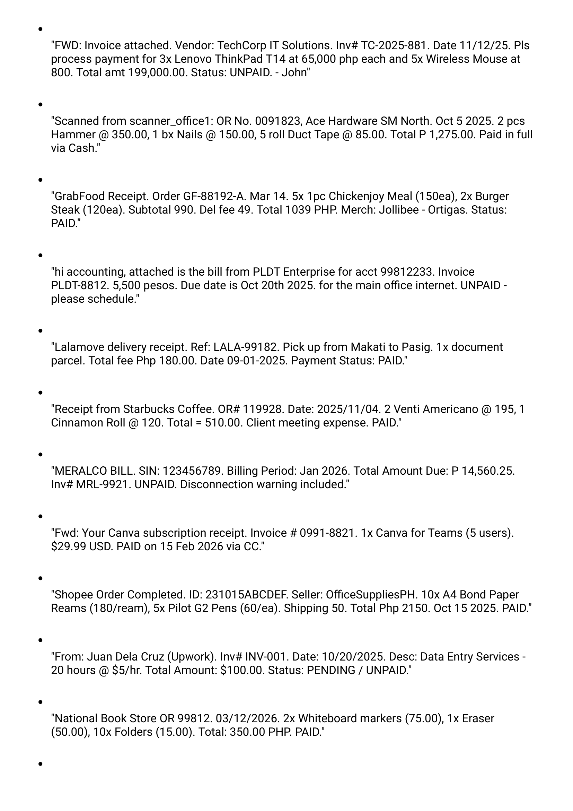
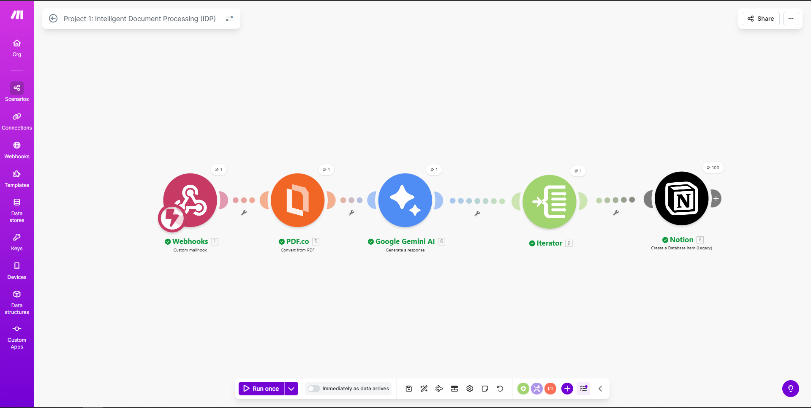

# AI-Driven Financial Pipeline: 100 Records in 3 minutes

---

## 1. Status: FUNCTIONAL AND VERIFIED

This automated Intelligent Document Processing (IDP) system has been fully tested using a multi-page "messy" PDF invoice and successfully extracts, validates, and migrates all data into a structured Notion database within seconds.

### Sample of messy data
To demonstrate the complexity of the extraction, here is the messy data before it is restructured.

*Click the image above to view the full PDF source.*

---

## 2. The Mission: Productivity Over Manual Labor

I built this project to solve a common and time-consuming business headache: the need to manually type data from hundreds of individual invoices into a central database. By leveraging modern AI tools, this pipeline eliminates human error and dramatically increases processing speed.

---

## 3. Tech Stack and Architecture

* **Orchestration:** Make.com (Free Tier) serves as the central engine, managing data flow and logic between applications.
* **OCR & Extraction:** PDF.co API handles the specialized task of reading and pulling raw text from multi-page PDFs.
* **Intelligence:** Google Gemini AI (Generative AI) is used for semantic understanding, accurately parsing unstructured OCR text into structured data.
* **Database:** Notion API is the platform used to store, organize, and present the final processed records.

---

## 4. Engineering Challenges and Problem Solving

No automation is perfect on the first try. During development, a significant technical hurdle was encountered with a `Function 'parseJSON' not found` error. This was caused by Google Gemini's output including "conversational noise" (extra text), which broke standard JSON parsing modules.

Instead of forcing a fragile JSON parse, I refactored the entire workflow architecture. The solution involved mapping the specific Array Output object directly from the Gemini module into a Make.com Iterator. This pivot made the workflow far more stable, cost-efficient (as it required fewer modules), and capable of handling bulk data processing without crashing.

---

## 5. Live Demonstration & Verification

This section provides visual proof of the system's ability to handle scale within free-tier limitations.

### 5-a. The 100 Operations Milestone (Live View)

This screenshot confirms the Make.com scenario successfully processed over 100 records in a single execution. All modules indicate "Green" status, proving 100% data throughput and error-free operation within free-tier constraints.

---

### 5-b. The Final Notion Database (Structure & Result)

This image shows the transformation of unstructured, multi-page data from PDFs into a clean, searchable, and organized Notion database.

---

## 6. Key Features and Scalability

* **Zero-Cost Engineering:** Maximized the utility of free-tier AI and automation tools to deliver professional-grade results with zero operational overhead.
* **Intelligent Bulk Data Management:** Engineered a robust system designed specifically to handle high-volume data extraction (100+ rows) efficiently in a single batch.
* **Intentionally Scalable Logic:** This project was intentionally capped at 100 records to operate strictly within the free tier limits of the APIs used. However, the underlying logic is fully developed, validated, and scalable to handle thousands of rows with professional subscriptions.

Beyond automation, I engineered a system to quantify the exact value of this pipeline. Click the link below to see the formula and calculations I used
to track the Total time saved, Value created and the ROI.

[**View Live ROI Dashboard**](https://github.com/Lawrenze09/ROI-Operations-Dashboard)
